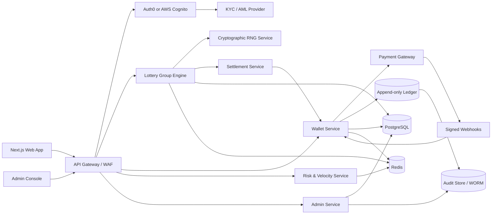
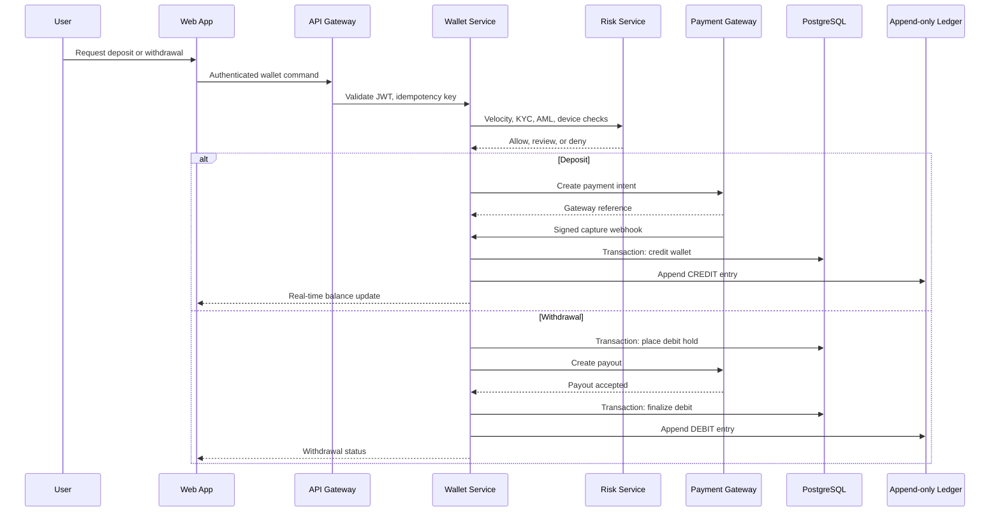
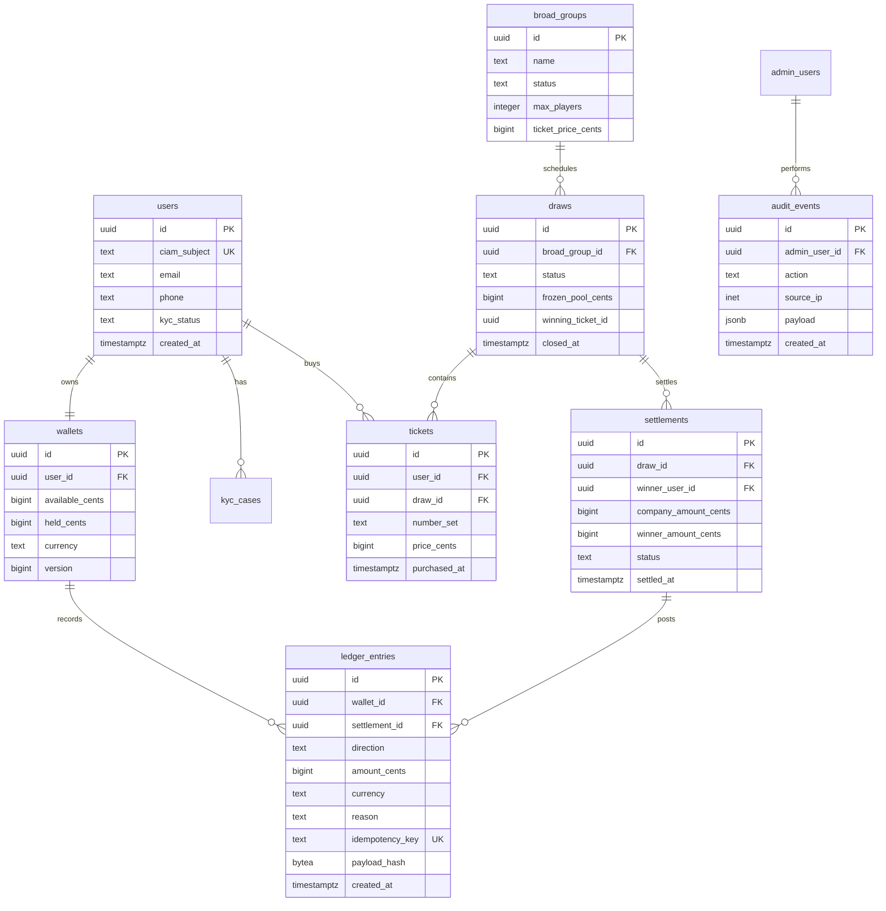

# LottoMax HLD and LLD

## Scope

LottoMax is a real-money lottery platform with CIAM onboarding, KYC/AML screening, wallet funding, ticket purchase, draw settlement, winner payout, company revenue capture, immutable ledgering, and administrator risk controls.

## High-Level Design

### Architecture Principles

| Principle | Decision |
| --- | --- |
| Identity | Auth0 or AWS Cognito with MFA, device risk, and KYC/AML vendor callbacks |
| Monetary precision | All balances use integer minor units; no floating-point arithmetic |
| Transaction integrity | PostgreSQL is the source of truth for wallet, tickets, draws, and append-only ledger entries |
| Low-latency reads | Redis caches draw state, hot wallet health, user session risk, and anti-abuse counters |
| Settlement | Draw pools are frozen before RNG selection; winner receives 85%, company receives 15% |
| Auditability | Admin and system actions record timestamp, IP, actor, correlation ID, and immutable payload hash |

### System Architecture

### Core Services

| Service | Responsibilities | Storage |
| --- | --- | --- |
| Identity Gateway | Validates JWTs, enforces MFA claims, maps CIAM identities to internal users | PostgreSQL user profile cache |
| KYC/AML Orchestrator | Manages verification state, sanctions checks, PEP checks, enhanced due diligence | PostgreSQL, vendor evidence vault |
| Wallet Service | Deposits, withdrawals, holds, releases, balance projections, payment webhooks | PostgreSQL, append-only ledger |
| Lottery Group Engine | Broad group creation, pause/resume, ticket inventory, pool freeze, draw conclusion | PostgreSQL, Redis |
| Settlement Service | Calculates pot split, debits escrow, credits winner and master wallet atomically | PostgreSQL transaction |
| Risk Service | Velocity abuse checks, hot wallet liquidity thresholds, withdrawal rules | Redis, PostgreSQL |
| Admin Service | Operator actions, financial risk dashboard, group management, audit trails | PostgreSQL, WORM audit |

### Deposit and Withdrawal Data Flow

### PostgreSQL ER Model

## Low-Level Design

### Settlement Algorithm

1. Start a serializable PostgreSQL transaction.
2. Lock the draw row and all tickets with `SELECT ... FOR UPDATE`.
3. Verify draw status is `OPEN` or `CLOSING`, group is not paused, and ticket count is valid.
4. Freeze pool as `ticket_count * ticket_price_cents`.
5. Request winning entropy from the RNG service with draw ID, ticket IDs, and a nonce.
6. Select the winning ticket by deterministic modulo over the sorted ticket list.
7. Calculate `company_amount = floor(pool * 15 / 100)` and `winner_amount = pool - company_amount`.
8. Insert settlement and two ledger entries in the same transaction.
9. Credit winner wallet and company master wallet.
10. Mark draw `SETTLED`, persist audit event, publish balance events.

### Tables and Constraints

| Table | Key Constraints |
| --- | --- |
| `wallets` | `CHECK (available_cents >= 0)`, optimistic `version` |
| `ledger_entries` | Append-only by policy and DB trigger; unique `idempotency_key` |
| `draws` | Status enum: `OPEN`, `PAUSED`, `FROZEN`, `SETTLED`, `VOID` |
| `settlements` | Unique `draw_id`; `company_amount_cents + winner_amount_cents = frozen_pool_cents` |
| `audit_events` | No update/delete privileges for app role |

### Security Controls

| Area | Control |
| --- | --- |
| CIAM | MFA via SMS/email, step-up auth for withdrawals and admin functions |
| PII | AES-256 encryption at rest, envelope keys in KMS, tokenized logs |
| PCI-DSS | Hosted payment fields, gateway tokenization, no raw PAN storage |
| Abuse | Redis velocity counters by user, device, card fingerprint, IP, and payout account |
| Admin | Least privilege roles, just-in-time elevation, immutable admin audit |

### Availability and Recovery

PostgreSQL uses multi-AZ deployment with point-in-time recovery. Redis uses clustered mode with replicas and conservative TTLs because it is a cache, not the ledger source of truth. Settlement jobs are idempotent and can be replayed using draw ID and settlement idempotency keys.
